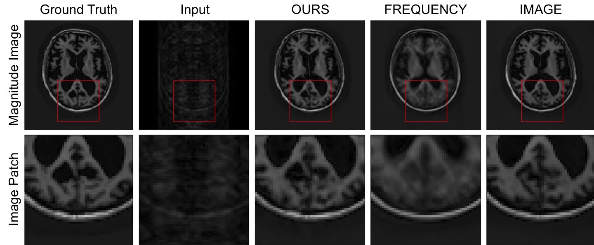

# Interlacer
Joint frequency- and image- space learning for Fourier imaging tasks.

keywords: image reconstruction, motion correction, denoising, magnetic resonance imaging, deep learning

## Dependencies
All dependencies required to run this code are specified in `environment.yml`. To create an anaconda environment with those dependencies installed, run `conda env create --name <env> --file environment.yml`. You will also need to add this repo to your python path (if you're using conda, `conda-develop /path/to/interlacer/`).

## Layer Implementation
If you'd like to incorporate our joint learning strategy into your own networks, we provide a standalone Keras Layer in `interlacer/layers.py`. This layer currently supports only 2D inputs.

## Training Code
Unfortunately, we are unable to provide the images used for training, due to license restrictions. However, we provide code to train on alternative datasets. To specify your own dataset paths and paths for output of training results, fill in the appropriate fields in `scripts/filepaths.py`.

The entry to our training code is in `scripts/train.py`, which is called via `python scripts/train.py $path_to_config.ini`. Running this script:
* reads the experiment configuration specified
* loads the appropriate model architecture 
* loads the training data
* executes training
* writes all training logs to a subdirectory created under `training/`.

We provide a helper script to generate config files for experiments comparing multiple models in `scripts/make_configs.py`. This script allows the user to specify the name of an experiment as well as lists of model/data parameters to be tried (e.g. a list of model architectures). Running `scripts/make_configs.py` creates the subdirectory `configs/$experiment_name`, which contains a single configuration file for each specified model/data combination. 

For SLURM users, running `python scripts/run_experiment.py ../configs/$experiment_name$` starts training (by running `train.py`) for each configuration file within the directory.

## Pretrained Models
Pretrained models are available in the `pretrained models` directory. This directory also includes a jupyter notebook which shows how to load and run inference using the models.

## Paper
If you use the ideas or implementation in this repository, please cite our [paper](https://arxiv.org/abs/2007.01441):

    @misc{singh2020joint,
        title={Joint Frequency- and Image-Space Learning for Fourier Imaging},
        author={Nalini M. Singh and Juan Eugenio Iglesias and Elfar Adalsteinsson and Adrian V. Dalca and Polina Golland},
        year={2020},
        eprint={2007.01441},
        archivePrefix={arXiv},
        primaryClass={cs.CV}
    }
